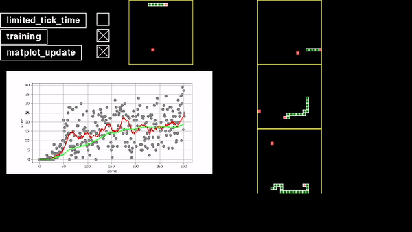

# Snake-Deep-Q-learning
Snake game in Python with deep q learning AI.

# prerequisites
- Matplotlib
- pygame
- numpy
- tensorflow (keras)

lauch AI playing snake
`python3 main_ai.py`

Play without AI
`python3 main.py`

4 games are played simultaneously. The main one, on top has exploration to 0%, and always play the best move it finds.  
The other 3, on the right, begin with 100% exploration and are slowly going to 10 % exploration

Each 8 move the main neural network is fitted.
the target neural network is updated every 1000 move.

The matlotib plots are integrated in the pygame window, and represent score for each game played on the main one (on top)
